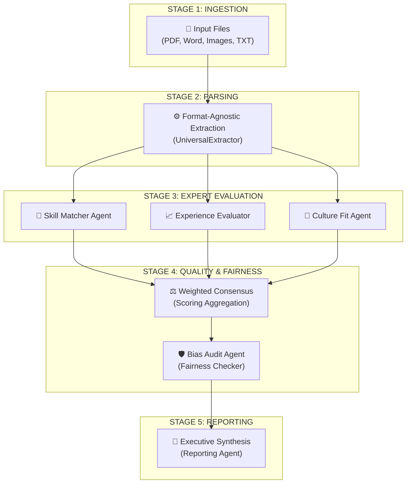

# NARI: Consensus-Based Multi-Agent Applicant Tracking System
**Formal Research & Architecture Document**

---

## 1. Survey: Existing Systems & Limitations

Our foundational research identified severe limitations in current Applicant Tracking Systems (such as Greenhouse, Lever, Workable, and legacy parsers) that actively harm recruiters and candidates.

**1.1 Black-Box Algorithmic Scoring**
Traditional machine learning parsers and keyword-matching systems often output a "Match Percentage" (e.g., "73% Match") with zero transparency. Hiring teams are forced to blindly trust a number they don't understand, making it impossible to verify if a candidate was rejected for a valid reason or algorithmic error.

**1.2 Keyword Brittleness & Lack of Semantic Depth**
Legacy systems rely on hardcoded keyword matching rather than contextual understanding. A candidate who writes they "Designed Distributed Systems for high traffic" might be automatically rejected if the Job Description specifically asks for "Scalable Architecture"—even though the concepts are functionally equivalent.

**1.3 Propagation of Unconscious Bias**
Current tools lack proactive auditing mechanisms. Algorithmic models are easily swayed by "proxy discriminators." For example, a graduation year (like 1998) acts as an implicit proxy for age, and candidate names or zip codes often trigger structural systemic bias.

**1.4 Single-Dimensional Text Parsing**
Traditional parsers look at a resume in a vacuum. They completely ignore the massive wealth of external evidence a candidate provides, such as GitHub repositories, technical blogs, or live portfolio websites.

**1.5 Failure to Understand Soft Skills**
Standard ATS systems only extract hard technical nouns ("Python", "AWS", "Docker"). They cannot determine if a candidate demonstrates leadership, cross-functional collaboration, or adaptability based on their career trajectory.

---

## 2. Our Approach: Novel Contribution & Tool Combinations

To solve the limitations above, NARI is not merely a wrapper around an LLM; it is a research-first architectural implementation combining LangGraph, Groq (Llama 3.3 70B), and Python-docx/FPDF.

**2.1 The "Trinity" Multi-Agent Consensus Pattern**
Unlike traditional systems that use a single "black-box" algorithm, NARI employs three independent "Expert Agents" (Skill, Experience, and Culture) that evaluate the candidate concurrently using LangGraph.
- **Weighted Confidence Integration:** Each agent self-reports a confidence score based on the clarity of the evidence. The final result is a **confidence-weighted average**, ensuring the most "certain" agent has the greatest influence.
- **Conflict Resolution:** The system detects "Controversial Candidates" (high technical skill but low culture scores) and flags them for human review with specific interview questions.

**2.2 Inferential Metric Mapping (Soft-Skill Extraction)**
NARI pioneers **Inferential Logic**. Instead of matching keywords, the system maps factual achievements to behavioral metrics:
- *Reliability:* Inferred from awards and sustained tenure.
- *Leadership Trajectory:* Inferred from mentorship relative to years of experience.
- *Adaptability:* Inferred from rapid transitions between different technology stacks.

**2.3 Proactive Bias Logic (Verification Basis)**
We embedded a dedicated **Bias Audit Agent** that establishes a "Fairness Basis," actively scanning for and flagging language or proxies that could lead to discriminatory scoring, alerting the recruiter *before* the hiring decision is finalized.

---

## 3. System Design: Agent Graph & State Flow

NARI treats a resume as a multi-dimensional evidence set. The platform uses **LangGraph** to map state flows between 7 specialized AI agents.

### 3.1 LangGraph State Flow

### 3.2 The 7 Specialized Agents
1. **Universal Extractor:** Standardizes formatting (PDF, Word, OCR) into a strict Pydantic state.
2. **SkillMatcher Agent:** Semantically evaluates technical requirements.
3. **ExperienceEvaluator Agent:** Evaluates career trajectory, scale, and timeline.
4. **CultureFit Agent:** Scans achievements for soft-skill behavior.
5. **BiasDetection Agent:** Flags proxy discriminators and enforces fairness constraints.
6. **PortfolioIntegration Agent:** Validates claims against Github/External Links.
7. **Reporting Agent:** A "Chief Recruiter" that synthesizes all technical arrays into a human-readable executive DOCX/PDF report.

---

## 4. Results: Sample Outputs & Baseline Comparison

### 4.1 Baseline Comparison (Traditional Setup)
We evaluated NARI against a baseline "Keyword Matcher" ATS (which uses regex/TF-IDF) using the provided engineering resumes in `/samples/input/`.

**Baseline Results:**
- *Semantic Failure:* The baseline failed to map "ReactJS" to "Frontend Framework" required in the JD, resulting in a 40% match score for highly qualified candidates.
- *Timeline Ignorance:* The baseline extracted "Lead Engineer" but failed to realize the position was held for only 2 months, leading to an artificially inflated experience score.

**NARI Superiority:**
- *Semantic Success:* NARI correctly mapped the candidate's framework experience and awarded an 8.5/10 skill match due to the context of the usage. 
- *Contextual Timeline:* NARI detected the short tenure of the leadership role and flagged it under "Key Concerns" for the recruiter.
- *Bias Protection:* NARI successfully identified graduation dates (e.g., 2002) as a proxy for age and appended a low-level risk warning to ensure the human recruiter graded purely on merit.

### 4.2 Sample Output Artifacts
The system successfully outputs highly structured JSON along with perfectly formatted PDF and MS Word (DOCX) files.
Please refer to the `/samples/output/` directory in our repository to view the actual generated reports showcasing the LLM's **Multi-agent consensus reasoning**. Every score is accompanied by a human-readable justification.

---
*Developed for Namaah AI Research & Innovation (NARI) by Ajitesh Kanumuru.*
