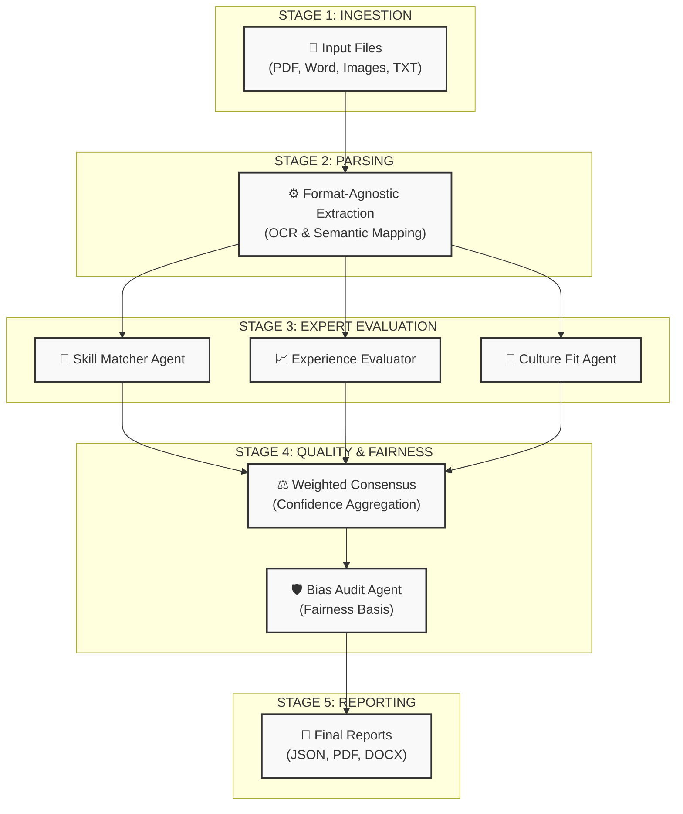

# NARI ATS System: Setup & Execution Guide (2026)

This document provides a foolproof, step-by-step guide to running the NARI Multi-Agent ATS system. Follow these commands in order to ensure a smooth execution.

---

## 🔄 NARI Pipeline Workflow

Below is a visual representation of how the NARI "Experts" process your files from start to end:



---

## 1. Environment Setup

### A. Navigate and Activate Virtual Environment

First, open your terminal and navigate to the downloaded repository folder:
```bash
cd nari-ats-github
```

It is recommended to use a virtual environment to avoid dependency conflicts.

**Windows (PowerShell):**

```powershell
python -m venv .venv
.\.venv\Scripts\Activate
```

**macOS / Linux:**

```bash
python3 -m venv .venv
source .venv/bin/activate
```

### B. Install Dependencies

Run this command to install all required libraries (LangGraph, FPDF2, python-docx, etc.).

```bash
pip install -r requirements.txt
```

---

## 2. Configuration

### A. Groq API Key

1. Open the `.env` file in the root directory.
2. Replace the placeholder with your actual Groq API key:
   ```env
   GROQ_API_KEY=gsk_your_key_here
   ```

### B. Verify Connectivity

Run this one-liner to ensure your API key and dependencies are working:

```bash
python -c "import os; from dotenv import load_dotenv; from langchain_groq import ChatGroq; load_dotenv(); print('Connection Successful!') if os.getenv('GROQ_API_KEY') else print('Error: GROQ_API_KEY not set')"
```

---

## 3. Running the System (Spoon-Fed Instructions)

You can run this project in two ways: using the Local Machine Command Line (No UI) or using the Localhost Web App (Full UI).

### Option A: Local Machine (Command Line Only)

This mode processes any resume and JD files placed in the `samples/input/` folder.

**Step 1:** Open your terminal and go to the project folder:

```bash
cd nari-ats-github
```

**Step 2:** Activate the Python virtual environment:

- **On Windows:**
  ```bash
  .\.venv\Scripts\Activate
  ```
- **On Mac/Linux:**
  ```bash
  source .venv/bin/activate
  ```

**Step 3:** Run the system main script:

```bash
python main.py
```

_Note: Follow the on-screen prompts. When asked about human-readable reports, type `both` to get DOCX and PDF files._

---

### Option B: Localhost Web App (Frontend + Backend)

This mode gives you the premium graphical interface in your browser. You need to open **TWO** separate terminal windows.

#### Terminal 1: Start the Backend (API Server)

**Step 1:** Open a terminal and go to the project folder:

```bash
cd nari-ats-github
```

**Step 2:** Activate the virtual environment:

- **On Windows:**
  ```bash
  .\.venv\Scripts\Activate
  ```

**Step 3:** Start the Python backend:

```bash
python app.py
```

_(Leave this terminal window open and running in the background!)_

#### Terminal 2: Start the Frontend (Web Interface)

**Step 1:** Open a completely **NEW** terminal window.

**Step 2:** Navigate directly to the `frontend` folder:

```bash
cd nari-ats-github/frontend
```

**Step 3:** (First time only) Install the website dependencies:

```bash
npm install
```

**Step 4:** Start the React website server:

```bash
npm run dev
```

**Step 5:** Open your web browser (Chrome, Edge, etc.) and go to this exact link:
**[http://localhost:5173/](http://localhost:5173/)**

---

## 4. Working with Your Data

### A. Adding Resumes

Place any resume files (PDF, DOCX, TXT, PNG, JPG) into the `samples/input/` directory.

### B. Adding Job Descriptions

Create a JSON file in `samples/input/` with the following structure (or edit the existing `job_description_senior_engineer.json`):

```json
{
  "job_title": "Software Engineer",
  "company": "Your Company",
  "required_skills": ["Python", "API Design"],
  "preferred_skills": ["Docker"],
  "min_years_experience": 3,
  "description": "Full job description text here..."
}
```

---

## 5. Viewing Results

All results are saved to the `samples/output/` directory:

- **`*_output.json`**: Full technical data and multi-agent reasoning.
- **`*_report.pdf`**: Professional, formatted summary for recruiters.
- **`*_report.docx`**: Editable version of the recruiter report.

---

## Troubleshooting Checklist

- [ ] **Missing Module?** Run `pip install -r requirements.txt` again.
- [ ] **Rate Limit (429)?** Wait 60 seconds. The system has built-in fallbacks, but high volume can trigger Groq limits.
- [ ] **Encoding Errors?** If on Windows, ensure your terminal supports UTF-8: `$env:PYTHONIOENCODING="utf-8"`.
