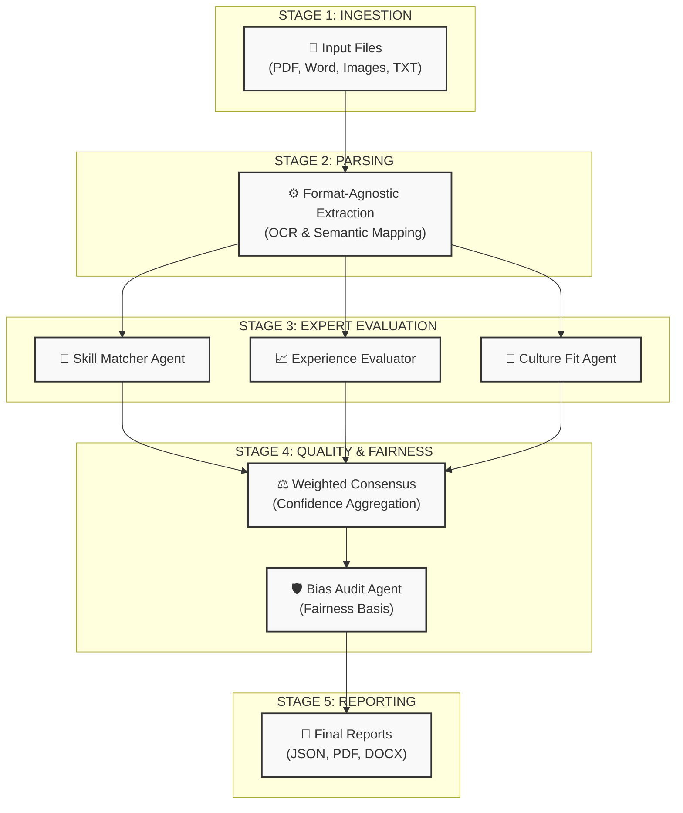

# System Workflow & Agent Architecture

The NARI system treats a resume not as a simple text file, but as a multi-dimensional evidence set that requires different "experts" to evaluate.

## The Multi-Agent Pipeline
The platform uses **LangGraph** to orchestrate independent AI agents. Below is the full vertical flow of the pipeline:

---

## Who Does What? (The 7 Agents)
The system isolates responsibility across 7 specialized AI agents to ensure depth, explainability, and fairness.

### A. The Extraction Layer
**1. Universal Extractor Agent**: Instead of one generic parser, we use specialized logic for PDF, DOCX, HTML, and Images (OCR). This ensures that even "creative" or scanned resumes are interpreted accurately into a unified schema.

### B. The Scoring Trinity (Parallel Evaluators)
Three independent agents evaluate the candidate simultaneously from different perspectives:
**2. SkillMatcher Agent**: Focuses on the "What." It performs semantic matching between the candidate's skills and the JD requirements. It understands that "React.js" and "React" are the same thing and evaluates the depth and recency of use.
**3. ExperienceEvaluator Agent**: Focuses on the "How Long" and "How Big." It analyzes career trajectory, looking for progression, promotion velocity, and the relevance of past roles to the target position.
**4. CultureFit Agent**: Focuses on the "Soft Skills." It scans achievements and project descriptions for evidence of communication, leadership, cross-functional collaboration, and adaptability.

### C. The Intelligence & Fairness Layer
**5. BiasDetection Agent**: A dedicated fairness auditor. It scans for "proxy discriminators" (like graduation years suggesting age) and flags them. It provides a narrative "Fairness Assessment" to ensure the hiring manager is aware of potential biases before reviewing the score.
**6. PortfolioIntegration Agent**: A validation expert. It attempts to cross-reference resume claims with external links (like GitHub repositories or portfolio URLs) to see if external evidence supports the candidate's claims.

### D. The Synthesis Layer
**7. Reporting Agent (Chief Recruiter)**: This agent synthesizes the findings from all other agents into a single, cohesive recommendation (e.g., STRONG YES, MAYBE). It doesn't just repeat the scores; it "elevates" them into a strategic executive summary for the hiring manager, exactly as a Senior Recruiter would.
